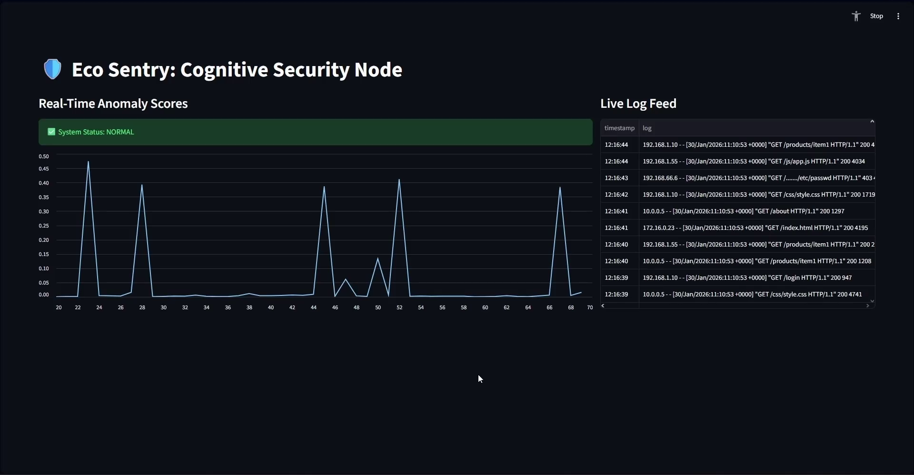

# 🛡️ Eco Sentry: Cognitive Edge Security

**Traditional firewalls rely on static rules. Eco Sentry relies on cognition.**

Eco Sentry is a "Cognitive Firewall" that uses Vector Search to detect unknown anomalies in real-time and an Edge-based LLM to explain *why* they are dangerous.



## ⚡ The Challenge vs. The Solution

| The Problem | The Eco Sentry Solution |
| :--- | :--- |
| **Rule Fatigue:** Traditional IDPS systems need constant manual rule updates for new attacks. | **Semantic Detection:** Uses **ChromaDB** to learn "normality." If a log entry is semantically distant from normal traffic, it's flagged automatically. |
| **Alert Noise:** Security analysts are overwhelmed by thousands of vague "Warning" alerts. | **Cognitive Analysis:** A local **TinyLlama-1.1B** Agent reviews only high-threat logs and provides a natural language explanation of the attack. |
| **Cloud Latency:** Sending every log to OpenAI/Cloud is slow and expensive. | **Edge Compute:** The AI runs locally (Dockerized), ensuring privacy and zero latency. |

## 🧠 Cognitive Workflow

When a threat is detected, Eco Sentry doesn't just block it—it *investigates* it.


1.  **Sentry Agent:** Monitors the live stream and calculates a "Normality Score" for every request.
2.  **The Filter:** Normal traffic (Score < 0.12) is visualized in Green.
3.  **The Trigger:** Anomalies (Score > 0.12) trigger the "Cognitive Loop."
4.  **Edge Node:** The Dockerized LLM receives the suspicious log, analyzes the payload (e.g., SQL patterns), and returns a verdict to the dashboard.

## 🏗 System Architecture

The system is built as a set of isolated microservices to ensure modularity and scalability.


## 🚀 Quick Start

### 1. Launch the Edge Node (Docker)
```bash
cd pipeline_a_edge_compute
docker compose up -d

```

### 2. Generate Training Data

```bash
cd data
python generate_logs.py

```

### 3. Start the Watchtower (UI)

```bash
cd pipeline_c_watchtower
streamlit run dashboard.py

```

### 4. Run "Live Fire" Simulation

```bash
python attack_simulator.py

```

## 🛠 Tech Stack

* **Core:** Python 3.10+, Docker, NVIDIA CUDA
* **AI Logic:** SentenceTransformers (Embeddings), vLLM (Inference), ChromaDB (Vector Store)
* **Interface:** Streamlit, Pandas